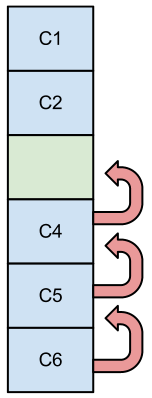

# Trabalhando com listas


Se quisermos armazenar muitas contas na memória, podemos fazer o uso de arrays, o qual já
estudamos nos capítulos anteriores. Arrays nos possibilitam guardar uma quantidade de
elementos e depois acessá-los de forma fácil.

Mas o problema é que manipular um array não é fácil. Por exemplo, imagine um array com 5
contas guardadas. Se quisermos remover a posição 1, como fazemos? Pois, se apagarmos,
precisaremos reordenar todo nosso array. E para inserir um elemento no meio do array?
Precisamos "abrir um buraco" no array, empurrando elementos pra baixo, para aí sim colocar
o novo elemento no meio.



## Facilitando o trabalho com coleções através das listas

Para resolver os problemas do array, podemos trabalhar com uma classe do C# chamada `List`.
Para utilizarmos uma lista dentro do código precisamos informar qual é o tipo de elemento que
a lista armazenará:

``` csharp
// cria uma lista que armazena o tipo Conta
List<Conta> lista = new List<Conta>();
```

Da mesma forma que criamos a lista de contas, também poderíamos criar uma lista de números
inteiros ou de qualquer outro tipo do C#. Essa lista do C# armazena seus elementos dentro
de um array.

Agora que instanciamos o `List`, podemos utilizar o método `Add` para armazenar novos
elementos:

``` csharp
Conta c1 = new ContaCorrente();
Conta c2 = new ContaPoupanca();
Conta c3 = new ContaCorrente();

// c1 fica na posição 0
lista.Add(c1);
// c2 na 1
lista.Add(c2);
// e c3 na 2
lista.Add(c3);
```

Se quisermos pegar essa Conta, podemos acessá-la pela sua posição (no caso, 0, igual no array):

``` csharp
Conta conta = lista[0];
```

Se quisermos remover uma das contas da lista, podemos usar o método `Remove` ou `RemoveAt`:

``` csharp
// A lista começa da seguinte forma: [c1, c2, c3]
// Depois do Remove, ela termina da seguinte forma: [c1, c3]
// A conta c1 continua na posição 0 e c3 vai para a posição 1
lista.Remove(c2); // remove pelo elemento

// Depois dessa chamada, c3 ocupa a posição 0: [c3]
lista.RemoveAt(0); // remove pelo índice
```

Se quisermos saber quantos elementos existem em nosso `List`, podemos simplesmente ler a
propriedade `Count`:

``` csharp
var c1 = new ContaCorrente();
var c2 = new ContaInvestimento();

lista.Add(c1);
lista.Add(c2);

int qtdDeElementos = lista.Count;
```

Também podemos descobrir se um elemento está dentro de uma lista:

``` csharp
Conta c1 = new ContaCorrente();
Conta c2 = new ContaPoupanca();

lista.Add(c1);

bool temC1 = lista.Contains(c1); // true
bool temC2 = lista.Contains(c2); // false
```

Um outro recurso que a classe `List` nos fornece é a iteração em cada um
dos seus elementos:

``` csharp
Conta c1 = new ContaCorrente();
Conta c2 = new ContaPoupanca();

lista.Add(c1);
lista.Add(c2);

foreach (Conta c in lista)
{
    MessageBox.Show(c.ToString());
}
```

Veja como lidar com coleções de elementos ficou muito mais fácil com a classe
`List`!

## Exercícios
1. Como descobrimos a quantidade de elementos armazenado em um `List`?

	``` csharp
 var lista = new List<Conta>();
 lista.Add(...);
 lista.Add(...);
 lista.Add(...);
	```

	* `lista.Size`

	* `lista.Count()`

	* `lista.Size()`

	* `lista.Count`

	* `lista.GetTotal()`

	
1. Qual o método que remove um elemento da lista pela sua posição?

	* `lista.Remove(posicao);`

	* `lista.RemoveAt(posicao);`

	* `lista.DeleteFrom(posicao);`

	* `lista.DeleteAt(posicao);`

	
1. A classe List implementa uma interface mais genérica de listas. Qual é?

	Você pode consultar a documentação da classe no próprio site da Microsoft:
	http://msdn.microsoft.com/pt-br/library/6sh2ey19.aspx

	* `IList`

	* Nenhuma

	* `List`

	* `GenericList`

	
1. Vamos modificar o código do projeto do banco para utilizar listas ao invés de arrays
	para guardar as contas cadastradas.

	Inicialmente substitua a declaração do atributo que guarda a referência para o array
	de contas pela declaração de uma lista de contas. Apague também a declaração do atributo
	`numeroDeContas`:

	``` csharp
 // Essa declaração será utilizada no lugar do array
 // de contas
 private List<Conta> contas;
	```

	Modifique o método `Form1_Load` para que ele instancie um `List<Conta>` ao invés de
	um array de contas:

	``` csharp
 private void Form1_Load(object sender, EventArgs e)
 {
    this.contas = new List<Conta>();

    // o resto do método continua igual
 }
	```

	Por fim, modificaremos o método `AdicionaConta` do formulário principal:

	``` csharp
 public void AdicionaConta(Conta conta) {
    this.contas.Add(conta);
    comboContas.Items.Add(conta);
 }
	```

	Depois dessas modificações, teste a aplicação.
